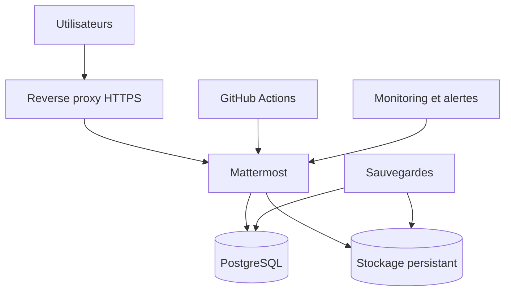

# Mattermost Enterprise Lab

Laboratoire DevOps reproduisant l'utilisation de **Mattermost dans une entreprise simulée**.

Ce projet part du code source open source de Mattermost et l'utilise comme base d'apprentissage pour étudier son architecture, le déployer, l'administrer, le sécuriser et l'intégrer à un environnement d'entreprise réaliste.

> **Statut actuel : Phase 1 — Découverte et préparation du dépôt.**  
> L'instance Mattermost n'est pas encore considérée comme installée ou configurée.

## Pourquoi ce projet ?

L'objectif n'est pas seulement de lancer une messagerie avec Docker. Le laboratoire doit permettre de comprendre comment une équipe technique exploite une plateforme collaborative en conditions proches du réel :

- communication entre départements ;
- administration des utilisateurs, équipes, rôles et permissions ;
- intégration avec GitHub et les pipelines CI/CD ;
- ChatOps et notifications automatiques ;
- supervision, centralisation des journaux et alertes ;
- gestion et documentation des incidents ;
- sécurisation, sauvegarde et restauration de l'infrastructure.

À terme, le projet devra servir de **laboratoire DevOps**, de **démonstration professionnelle** et de **projet portfolio**.

## Scénario d'entreprise

Nous simulons une entreprise numérique qui conçoit et exploite des applications web et mobiles. Mattermost devient son centre de communication opérationnelle.

| Département | Responsabilités principales | Exemples de canaux |
| --- | --- | --- |
| Direction | Stratégie, décisions, validation | `~direction`, `~annonces`, `~strategie` |
| Développement | Frontend, backend, mobile, QA | `~developers`, `~frontend`, `~backend`, `~code-review`, `~bugs` |
| DevOps | Infrastructure, CI/CD, sécurité | `~devops`, `~deployments`, `~monitoring`, `~security`, `~incidents` |
| Support | Assistance et remontée des bugs | `~support`, `~support-technique`, `~bugs-clients` |
| Commercial | Prospects, clients, partenariats | `~commercial`, `~prospects`, `~clients` |
| Marketing | Campagnes, contenus, communication | `~marketing`, `~campagnes`, `~contenus` |

Des comptes fictifs représenteront les différents métiers afin de tester concrètement les droits d'accès, les flux de communication et les procédures internes.

## Architecture cible



L'architecture sera construite progressivement autour de :

- Linux Ubuntu ;
- Docker et Docker Compose ;
- Mattermost ;
- PostgreSQL ;
- Nginx ou Traefik ;
- HTTPS avec Let's Encrypt ;
- GitHub Actions ;
- Prometheus, Grafana, Loki et Alertmanager ;
- sauvegardes automatisées et tests de restauration.

Docker Compose sera utilisé pour les étapes locales, l'apprentissage et les simulations. Une architecture Kubernetes et haute disponibilité pourra être étudiée dans une phase avancée.

## Code source et dépôts Git

Ce dépôt est basé sur le dépôt officiel [`mattermost/mattermost`](https://github.com/mattermost/mattermost). Il contient notamment :

| Dossier | Rôle général |
| --- | --- |
| `server/` | Serveur et logique backend en Go |
| `webapp/` | Interface web en React |
| `api/` | Définitions et composants liés aux API |
| `e2e-tests/` | Tests de bout en bout |
| `docs/` | Documentation présente dans le projet source |
| `.github/` | Workflows et configuration GitHub |

Deux remotes sont conservés :

```text
origin   -> https://github.com/KGS-L/mattermost-mattermost-enterprise-lab.git
upstream -> https://github.com/mattermost/mattermost.git
```

- `origin` reçoit les travaux propres au laboratoire ;
- `upstream` permet de suivre les évolutions du projet Mattermost officiel.

Vérification :

```bash
git remote -v
git branch --show-current
git status
```

Récupération des références officielles sans modifier la branche locale :

```bash
git fetch upstream
```

Les mises à jour d'`upstream` seront intégrées de manière contrôlée afin de ne pas écraser les configurations et la documentation du laboratoire.

## Méthode de travail

Chaque nouvelle brique suit la même démarche :

1. comprendre son rôle ;
2. expliquer le besoin métier ou technique auquel elle répond ;
3. concevoir son intégration à l'architecture ;
4. l'installer et la configurer ;
5. la tester dans un scénario normal ;
6. provoquer ou simuler une panne pertinente ;
7. diagnostiquer et corriger le problème ;
8. documenter la procédure et le retour d'expérience.

Les secrets, mots de passe et fichiers `.env` réels ne doivent jamais être commités. Seuls des exemples sans données sensibles peuvent être versionnés.

## Simulations prévues

### Livraison d'une fonctionnalité

```text
Issue -> Développement -> Pull Request -> Code review -> Tests -> Merge -> Déploiement
```

Le résultat du pipeline sera envoyé dans le canal `~deployments`.

### Gestion d'un incident

```text
Détection -> Alerte Mattermost -> Investigation -> Correction -> Déploiement -> Post-mortem
```

Les incidents seront coordonnés dans `~incidents` ou dans un canal dédié, avec possibilité d'utiliser les Playbooks Mattermost.

### Escalade d'un problème client

```text
Support -> Bug confirmé -> Équipe de développement -> Correction -> Support informé -> Client informé
```

## Roadmap

- [x] Définir la vision et le scénario de l'entreprise simulée
- [x] Cloner le dépôt source officiel de Mattermost
- [x] Configurer `origin` et conserver Mattermost dans `upstream`
- [ ] Étudier la structure du monorepo et ses composants
- [ ] Identifier les prérequis de l'environnement local
- [ ] Lancer une première instance de développement
- [ ] Configurer les équipes, utilisateurs, canaux, rôles et permissions
- [ ] Construire le déploiement Docker avec PostgreSQL et volumes persistants
- [ ] Ajouter le reverse proxy, le domaine et HTTPS
- [ ] Connecter GitHub et mettre en place les notifications ChatOps
- [ ] Construire une pipeline CI/CD avec GitHub Actions
- [ ] Ajouter métriques, dashboards, journaux et alertes
- [ ] Formaliser les procédures d'incident et les post-mortems
- [ ] Automatiser les sauvegardes et tester une restauration complète
- [ ] Étudier Kubernetes, la haute disponibilité, le SSO et une architecture multi-serveurs

## Environnements visés

Le laboratoire pourra progressivement distinguer :

- `development` pour le travail local ;
- `staging` pour les validations avant livraison ;
- `production` pour une simulation d'exploitation réelle.

Chaque alerte et notification de déploiement devra préciser explicitement l'environnement concerné.

## Prochaine étape

La prochaine étape consiste à **inspecter la structure du dépôt et les outils de développement fournis par Mattermost** avant de lancer l'application. Nous identifierons notamment :

- les composants réellement nécessaires ;
- les services Docker déjà prévus pour le développement ;
- les versions requises de Go, Node.js, PostgreSQL et des autres dépendances ;
- la différence entre exécuter le code source et déployer les images Docker officielles.

## Documentation de référence

- [Dépôt source officiel Mattermost](https://github.com/mattermost/mattermost)
- [Documentation Mattermost](https://docs.mattermost.com/)
- [Documentation développeur Mattermost](https://developers.mattermost.com/)
- [Déploiement officiel avec des conteneurs](https://docs.mattermost.com/deployment-guide/server/deploy-containers)

## Licence et attribution

Mattermost est un projet open source/open core soumis aux licences et mentions fournies dans le dépôt d'origine. Les fichiers `LICENSE.txt`, `LICENSE.enterprise` et `NOTICE.txt` présents dans le projet doivent être conservés.

Ce laboratoire est un projet pédagogique indépendant. Il n'est ni un produit officiel de Mattermost, Inc., ni affilié ou approuvé par Mattermost, Inc. Les marques et noms de produits appartiennent à leurs propriétaires respectifs.

## Auteur

**Kevin Jonas SO**  
Développeur Full Stack et apprenant DevOps  
[GitHub](https://github.com/jonas-so) · [LinkedIn](https://www.linkedin.com/in/jonas-so/)

